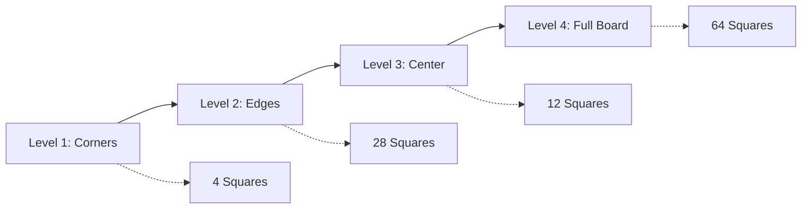

# 🏛️ Chess Nomenclature Game
### *Master Chess Square Notation Through Advanced Learning Science*

<div align="center">


**A scientifically-designed chess learning application that uses cognitive science principles to help you master chess square notation efficiently.**

[🎮 Play Now](#quick-start) • [🧠 The Science](#the-science-behind-learning) • [⚡ Features](#features) • [🚀 Quick Start](#quick-start)

</div>

---

## 🧠 The Science Behind Learning

This isn't just another chess game—it's a **cognitive learning laboratory** built on proven educational science:

### 🔄 **Spaced Repetition Algorithm**
```
┌─────────────────────────────────────────────────────────────┐
│  Mistake Tracking → Recent Errors (40% Priority)           │
│  Performance Data → Low Success Rate (30% Priority)        │
│  Random Selection → New Content (30% Priority)             │
└─────────────────────────────────────────────────────────────┘
```

### 📊 **Adaptive Difficulty Progression**


### 🎯 **Dual Learning Modes**
<table>
<tr>
<td width="50%">

**🔸 Square → Notation Mode**
- Visual square highlighting
- Text input required
- Strengthens recognition → recall

</td>
<td width="50%">

**🔹 Notation → Square Mode**  
- Text notation display
- Click target square
- Strengthens recall → recognition

</td>
</tr>
</table>

---

## ✨ Features

### 🎨 **Advanced Rendering Engine**
- **High-DPI Canvas Support**: Crisp visuals on all displays
- **Animated Highlighting**: Pulsing square indicators with smooth transitions
- **Responsive Design**: Adapts to all screen sizes
- **Accessibility**: Full screen reader support and keyboard navigation

### 📈 **Performance Analytics**
```
📊 Real-time Statistics:
┌─────────────────────────────┐
│ ⚡ Live Score & Streak      │
│ 🎯 Accuracy Percentage      │
│ ⏱️  Average Response Time    │
│ 📅 Session Progress         │
│ 🏆 Personal Best Records    │
└─────────────────────────────┘
```

### 🧠 **Intelligent Learning System**
- **Per-Square Performance Tracking**: Individual mastery metrics for all 64 squares
- **Mistake Pattern Recognition**: Identifies and prioritizes problem areas
- **Auto-Level Progression**: Advances difficulty based on 80% mastery threshold
- **Persistence**: Progress saved across sessions with localStorage

### 🎮 **Enhanced User Experience**
- **Audio Feedback**: Success/error tones with Web Audio API
- **Visual Feedback**: Color-coded responses and animations
- **Keyboard Shortcuts**: `Enter` to submit, `Escape` to skip, `Ctrl+H` for hints
- **Hint System**: Contextual clues for both game modes

---

## 🚀 Quick Start

### 🌐 **Instant Play**
Simply open `index.html` in any modern web browser—no installation required!

### 🎯 **Game Modes**

<details>
<summary><b>🔸 Square → Notation Mode</b></summary>

```
1. 🎯 Square highlighted on board
2. ⌨️  Type the chess notation (e.g., "e4")
3. ✅ Submit answer or press Enter
4. 📊 Receive instant feedback + points
```
</details>

<details>
<summary><b>🔹 Notation → Square Mode</b></summary>

```
1. 📝 Notation displayed (e.g., "E4")
2. 🖱️  Click the corresponding square
3. ✅ Instant validation
4. 📊 Score and progress tracking
```
</details>

### 🎚️ **Difficulty Levels**

| Level | Name | Squares | Focus Area |
|-------|------|---------|------------|
| 🔰 **1** | Corners | 4 squares | `a1`, `a8`, `h1`, `h8` |
| 🔸 **2** | Edges | 28 squares | All board perimeter |
| 🔹 **3** | Center | 12 squares | Central battlefield |
| 🏆 **4** | Full Board | 64 squares | Complete mastery |

---

## 🎓 Learning Science Deep Dive

### 🔬 **Cognitive Load Theory Implementation**
```javascript
// Graduated complexity prevents cognitive overload
DIFFICULTY_LEVELS: {
    1: { name: 'Corners', squares: ['a1', 'a8', 'h1', 'h8'] },
    2: { name: 'Edges', squares: [/* 28 edge squares */] },
    3: { name: 'Center', squares: [/* 12 center squares */] },
    4: { name: 'Full Board', squares: null } // All 64 squares
}
```

### 📊 **Spaced Repetition Mathematics**
```javascript
// Priority weighting algorithm
const prioritization = {
    recentMistakes: 0.4,    // 40% - Recent errors need immediate attention
    lowPerformance: 0.3,    // 30% - Struggling squares get extra practice  
    randomNew: 0.3          // 30% - Maintains broad knowledge base
};
```

### 🎯 **Mastery Tracking**
```javascript
// Per-square performance metrics
squarePerformance = {
    attempts: number,       // Total practice attempts
    correct: number,        // Successful responses
    averageTime: ms,        // Speed optimization
    repetitionLevel: 0-5,   // Spaced repetition stage
    lastSeen: timestamp     // Temporal spacing
}
```

---

## 🛠️ Technical Architecture

### 🎨 **Rendering Pipeline**
```
🖼️  Canvas Setup → 🎨 Board Drawing → 🔆 Coordinate Labels → ✨ Animations
     ↓                    ↓                   ↓                  ↓
   HiDPI Scale      Chess Squares      File/Rank Labels    Pulsing Effects
```

### 🔊 **Audio System**
```javascript
// Web Audio API implementation
playSuccess() {
    this.playTone(523.25, 0.2); // C5 note
    setTimeout(() => this.playTone(659.25, 0.2), 100); // E5 harmony
}
```

### 💾 **Data Persistence**
```json
{
  "stats": { "gamesPlayed": 42, "accuracy": 87.3, ... },
  "squarePerformance": [["e4", { "attempts": 15, "correct": 13, ... }]],
  "difficulty": 3,
  "levelProgress": 65.2,
  "preferences": { "showNotation": true, ... }
}
```

---

## 🎮 Controls & Shortcuts

### ⌨️ **Keyboard**
- `Enter` → Submit answer
- `Escape` → Skip current question  
- `Ctrl/Cmd + H` → Show hint
- `Tab` → Navigate interface

### 🖱️ **Mouse**
- **Click squares** → Answer in Notation→Square mode
- **Toggle notation** → Show/hide board coordinates
- **Settings gear** → Access preferences

### 📱 **Touch**
- **Tap squares** → Touch-friendly for mobile
- **Responsive layout** → Adapts to screen size

---

## 🏆 Scoring System

### 💎 **Point Values**
```
✅ Correct Answer: 10 points
⚡ Speed Bonus: +5 points (under 5 seconds)
🔥 Streak Multiplier: 1.2x per consecutive correct
🎯 Level Completion: Auto-advancement bonus
```

### 📊 **Performance Metrics**
- **Accuracy**: Overall success rate percentage
- **Speed**: Average response time optimization
- **Consistency**: Streak tracking for sustained performance
- **Mastery**: Per-square proficiency measurement

---

## 🔮 Future Enhancements

- [ ] 🌐 **Multiplayer Mode**: Competitive notation races
- [ ] 📱 **Mobile App**: Native iOS/Android versions  
- [ ] 🎨 **Themes**: Custom board designs and color schemes
- [ ] 📈 **Analytics Dashboard**: Detailed progress visualization
- [ ] 🏅 **Achievement System**: Unlockable badges and milestones
- [ ] 🔊 **Voice Input**: Speech recognition for hands-free play

---

## 🤝 Contributing

We welcome contributions! This project demonstrates:
- **Educational Technology** principles
- **Game-based Learning** implementation  
- **Cognitive Science** applications
- **Modern Web Development** practices

---

<div align="center">

### 🎯 **Master Chess Notation Through Science**

*Built with passion for learning and precision in code*

[](LICENSE)
[](https://developer.mozilla.org/en-US/docs/Web/JavaScript)
[](https://developer.mozilla.org/en-US/docs/Web/API/Canvas_API)
[](https://developer.mozilla.org/en-US/docs/Web/CSS)

**[⭐ Star this repository if it helped your chess journey!](https://github.com/rohithreddy1095/cng)**

</div>
